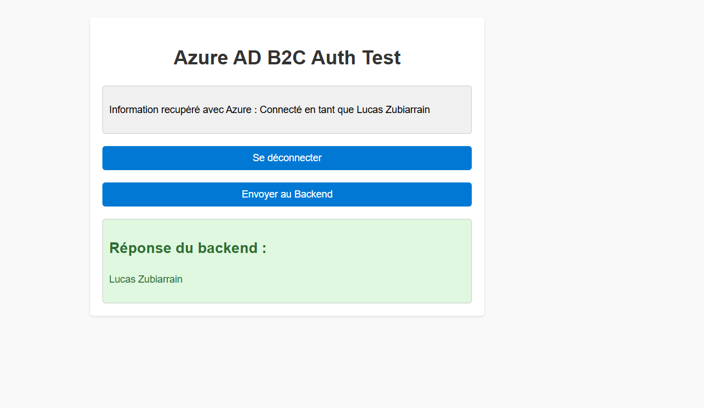

# Intégration de l'authentification Azure AD B2C avec React et FastAPI

Ce projet montre comment intégrer l'authentification Azure Active Directory B2C (Azure AD B2C) dans une application **React** en frontend et un **FastAPI** en backend, en utilisant **JWT** pour sécuriser les échanges entre les deux parties.

## Table des matières

1. [Introduction](#introduction)
2. [Configuration d'Azure AD B2C](#configuration-dazure-ad-b2c)
   1. [Créer un locataire Azure AD B2C](#créer-un-locataire-azure-ad-b2c)
   2. [Enregistrer les applications](#enregistrer-les-applications)
   3. [Configurer les User Flows](#configurer-les-user-flows)
   4. [Obtenir les clés publiques et l'URL de découverte](#obtenir-les-clés-publiques-et-lurl-de-découverte)
3. [Configuration du Frontend React avec Azure AD B2C](#configuration-du-frontend-react-avec-azure-ad-b2c)
   1. [Configurer MSAL dans React](#configurer-msal-dans-react)
   2. [Installer les dépendances](#installer-les-dépendances)
   3. [Mettre en place l'authentification dans React](#mettre-en-place-lauthentification-dans-react)
4. [Configuration du Backend FastAPI pour l'authentification JWT](#configuration-du-backend-fastapi-pour-lauthentification-jwt)
   1. [Installer les dépendances](#installer-les-dépendances)
   2. [Créer le fichier auth.py pour valider les tokens JWT](#créer-le-fichier-authpy-pour-valider-les-tokens-jwt)
5. [Tester l'authentification avec Postman](#tester-lauthentification-avec-postman)
6. [Lancer l'application](#lancer-lapplication)

---

## 1. Introduction

Ce projet démontre l'intégration d'Azure AD B2C dans une application utilisant **React** pour le frontend et **FastAPI** pour le backend. L'application est sécurisée à l'aide de **JWT** (JSON Web Tokens) pour l'authentification et l'autorisation. L'objectif est de fournir une solution sécurisée, avec la gestion des utilisateurs via Azure AD B2C, permettant aux utilisateurs de se connecter via un fournisseur d'identité (par exemple, via leur compte Microsoft ou Google).

---

## 2. Configuration d'Azure AD B2C

### 2.1 Créer un locataire Azure AD B2C

1. Ouvre le **Portail Azure**.
2. Dans le menu de gauche, sélectionne **Azure Active Directory** puis **Azure AD B2C**.
3. Clique sur **Créer un locataire** et suis les étapes pour créer un nouveau locataire.
4. Prends note du nom du locataire car tu en auras besoin plus tard.

### 2.2 Enregistrer les applications

**Backend - API (FastAPI) :**

1. Va dans **App registrations** sous Azure AD B2C.
2. Clique sur **New registration** et crée une application pour le backend (par exemple, "FastAPI Backend").
3. Choisis "Comptes dans n'importe quel annuaire Azure AD". Pas besoin de spécifier une URL de redirection.
4. Naviguer dans exposer une api
5. Configure une étendue pour l'API afin d'exposer une autorisation, par exemple :

   - **Nom d'affichage** : "APITest"
   - **Scopet personnalisé** : `https://<tenant>.onmicrosoft.com/test/auth`
   - **Nom d'affichage du consentement administrateur**: backend authentification

   - **Description du consentement administrateur** : Autorise le backend à l'authentification

6. Prends note de l'**Application ID** et du **Directory ID**, tu en auras besoin dans la suite.

**exemple :**


**Frontend - Application React (SPA) :**

1. Crée une nouvelle application dans **App registrations** pour le frontend.
2. Choisis "Single-page application (SPA)" et renseigne l'**URL de redirection** comme `http://localhost:5173`.
3. Prends note de l'**Application ID**.

**Auroriser l'api**

1. Naviguer dans api autorisées
2. Ajouter une autorisation
3. API utilisé par mon organisation
4. Selectionner l'api de vootre backend que vous avez exposé
5. Accorder un consontement d'adminnistrateur

### 2.3 Configurer les User Flows

1. Sous **User Flows**, crée un nouveau flow pour la connexion et l'inscription, choisis "Sign up and sign-in".
2. Configure les champs à afficher (par exemple, email, mot de passe).
3. Une fois le flow créé, prends note de son nom, tu en auras besoin pour la configuration dans React.

### 2.4 Obtenir les clés publiques et l'URL de découverte

1. Va dans **User Flows**, sélectionne ton flux créé, puis dans **API**, copie l'**URL de découverte** :  
   `https://<tenant>.b2clogin.com/<tenant>.onmicrosoft.com/<policyName>/.well-known/openid-configuration`.

---

## 3. Configuration du Frontend React avec Azure AD B2C

### 3.1 Configurer MSAL dans React

1. Modifier le fichier `authConfig_exemple.js'un fichier` en `authConfig.js` dans ton dossier `src` de React.
2. Ajoute la configuration suivante avec les bonnes informations que tu as récupérées d'Azure AD B2C :

```javascript
import { PublicClientApplication } from "@azure/msal-browser";

const msalConfig = {
  auth: {
    clientId: "<clientId>", // Application ID
    authority: `https://<tenant>.b2clogin.com/<tenant>.onmicrosoft.com/<policyName>`, // Remplace <tenant> et <policyName>
    knownAuthorities: [`<tenant>.b2clogin.com`],
    redirectUri: "http://localhost:5173",
  },
};

const msalInstance = new PublicClientApplication(msalConfig);

export default msalInstance;
```

### 3.2 Installer les dépendances

Dans ton projet React, installe les librairies nécessaires :

```bash
npm install @azure/msal-react @azure/msal-browser
```

### 3.3 Mettre en place l'authentification dans React

Dans `App.js`, implémente la logique pour la connexion et la gestion des tokens JWT :

```javascript
import React, { useState } from "react";
import { useMsal } from "@azure/msal-react";

const App = () => {
  const { instance, accounts } = useMsal();
  const [backendResponse, setBackendResponse] = useState(null);

  const handleLogin = async () => {
    try {
      await instance.loginPopup({
        scopes: [
          "openid",
          "profile",
          "email",
          "https://<tenant>.onmicrosoft.com/test/auth", // Scope pour l'API
        ],
      });
    } catch (error) {
      console.error("Erreur de connexion :", error);
    }
  };

  const handleLogout = () => {
    instance.logoutPopup();
  };

  const sendToBackend = async () => {
    try {
      const tokenResponse = await instance.acquireTokenPopup({
        scopes: ["https://<tenant>.onmicrosoft.com/test/auth"],
      });
      const accessToken = tokenResponse.accessToken;

      const response = await fetch("http://localhost:8000/api/endpoint", {
        method: "POST",
        headers: {
          Authorization: `Bearer ${accessToken}`,
          "Content-Type": "application/json",
        },
        body: JSON.stringify({ user: accounts[0]?.idTokenClaims.given_name }),
      });

      const data = await response.json();
      setBackendResponse(data.user);
    } catch (error) {
      console.error("Erreur lors de l'envoi au backend:", error);
    }
  };

  return (
    <div>
      {accounts.length > 0 ? (
        <>
          <p>Connecté en tant que {accounts[0]?.idTokenClaims.name}</p>
          <button onClick={handleLogout}>Se déconnecter</button>
          <button onClick={sendToBackend}>Envoyer au Backend</button>
        </>
      ) : (
        <button onClick={handleLogin}>Se connecter</button>
      )}
      {backendResponse && <div>{backendResponse}</div>}
    </div>
  );
};

export default App;
```

---

## 4. Configuration du Backend FastAPI pour l'authentification JWT

### 4.1 Installer les dépendances

Installe les dépendances nécessaires pour gérer l'authentification JWT :

```bash
pip install fastapi uvicorn python-jose pyjwt
```

### 4.2 Créer le fichier auth.py pour valider les tokens JWT

Modifier le fichier config_exemple.py en config.py et remplacer les informations nécessaires

```python
# config.py

DISCOVERY_URL = "https://<tenant>.b2clogin.com/<tenant>.onmicrosoft.com/v2.0/.well-known/openid-configuration?p=B2C_1_signinsignup" # flux de ton B2C
API_CLIENT_ID = "ton client id"  # Client ID de ton API backend

```

---

## 5. Lancer l'application

### Lancer le Backend FastAPI

```bash
uvicorn main:app --reload
```

### Lancer le Frontend React

```bash
npm run dev
```

Ton application React sera accessible à `http://localhost:5173`, et le backend FastAPI à `http://localhost:8000`.

---

### Tester l'application

Pour tester l'application, suivez ces étapes :

1. **Lancer l'application Frontend (React)**

2. **Se connecter à l'application** :

   - Sur la page d'accueil, vous verrez un bouton "Se connecter".
   - Cliquez dessus pour lancer la procédure d'authentification via Azure AD B2C.
   - Vous serez redirigé vers une page de connexion où vous devrez entrer vos identifiants Azure AD B2C. (Assurez-vous d'utiliser un compte enregistré dans votre locataire Azure AD B2C).

3. **Envoyer des données au Backend** :

   - Une fois connecté, l'application affichera vos informations de connexion.
   - Cliquez sur le bouton "Envoyer au Backend" pour envoyer une requête à votre backend FastAPI.
   - Si l'authentification est réussie, vous devriez voir une réponse du backend avec vos informations.

4. **Se déconnecter** :

   - Si vous souhaitez vous déconnecter, cliquez sur le bouton "Se déconnecter". Cela vous redirigera vers la page de connexion, et vous devrez vous reconnecter si vous souhaitez effectuer une autre action.

5. **Vérifier la réponse Backend** :
   - Après avoir cliqué sur "Envoyer au Backend", si la requête a bien été envoyée, vous verrez les informations retournées par le backend dans la section "Réponse du backend". Cela pourrait inclure des détails sur l'utilisateur authentifié récupérés via l'API.


